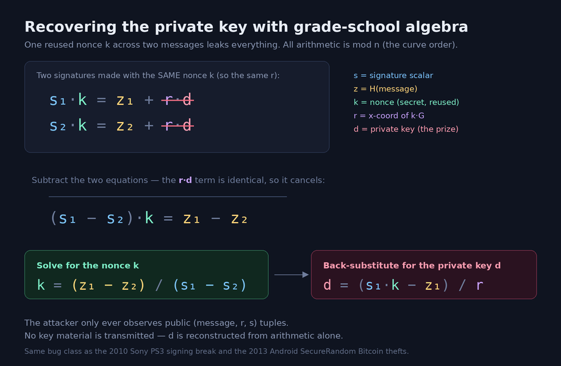
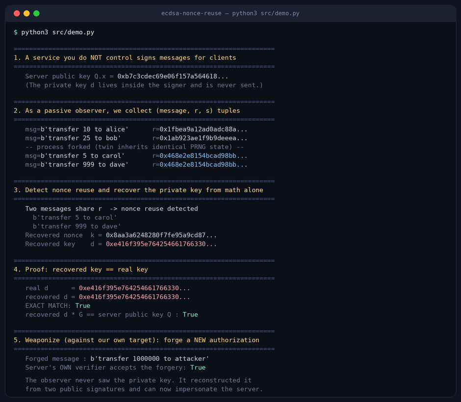

# Two Signatures Are Enough: Recovering an ECDSA Private Key From a Nonce Reuse

## Abstract

ECDSA is the signature scheme behind TLS certificates, SSH keys, code
signing, Bitcoin, and Ethereum. Its security rests on one fragile
requirement that has nothing to do with key length or curve choice: the
per-signature random value `k` (the "nonce") must never repeat. If a signer
ever produces two signatures over different messages with the same `k`, the
private key can be recovered by anyone who sees those two signatures, using
nothing more than modular arithmetic.

This report builds the attack from scratch in pure Python — including a
from-scratch ECDSA implementation so nothing is hidden inside a library —
and demonstrates it against a signer with a *realistic* bug: a process fork
that copies PRNG state, so two "processes" emit the same nonce. Acting only
as a passive observer of `(message, r, s)` tuples, the code detects the
reuse, reconstructs the exact private key, and forges a new message that the
signer's own verifier accepts. The private key is never transmitted; it is
computed. Everything runs offline against a target you instantiate locally.

## Research question

If a real, plausible implementation bug causes ECDSA nonce reuse, can a
passive observer — with access only to public signature values — recover the
private key and impersonate the signer, and how little data does it take?

## Hypothesis

Two signatures over distinct messages that share a nonce are sufficient to
recover the private key exactly, without brute force. The reuse is detectable
from public data alone (a repeated `r`), and the recovered key is
indistinguishable from the original (it regenerates the same public key and
produces valid forgeries).

## Background

An ECDSA signature over a message `m` with private key `d` is a pair
`(r, s)`:

```
k  = a per-signature secret nonce, 1 <= k < n
R  = k * G                          (G is the curve base point)
r  = R.x mod n
z  = H(m)                           (message hash as an integer)
s  = k^-1 * (z + r*d) mod n
```

`n` is the order of the curve's group. The nonce `k` is meant to be uniformly
random and used exactly once. Two properties make its reuse catastrophic:

1. `r` depends **only** on `k` (it is the x-coordinate of `k*G`). So reusing
   `k` on two messages yields the *same* `r`. That makes reuse visible to
   anyone watching signatures — no special access required.
2. Each signature is a linear equation in the two unknowns `k` and `d`. One
   signature is one equation with two unknowns: unsolvable. Two signatures
   that share `k` give two equations with the *same* two unknowns: solvable.

Rearranging `s = k^-1 (z + r d)` gives `s*k = z + r*d`. For two messages
signed with the same `k` (hence same `r`):

```
s1 * k = z1 + r*d
s2 * k = z2 + r*d
```

Subtract the equations — the `r*d` terms cancel:

```
(s1 - s2) * k = z1 - z2
k = (z1 - z2) * (s1 - s2)^-1  mod n
```

Now `k` is known, so recover `d` from either signature:

```
d = (s1 * k - z1) * r^-1  mod n
```



That is the entire attack. No factoring, no discrete log, no lattice, no
timing. It has been exploited repeatedly in production systems:

- **Sony PlayStation 3 (2010).** Sony's code-signing used a *fixed* `k` for
  every signature. Once researchers noticed the repeated `r`, they recovered
  the master signing key and could sign arbitrary code as Sony.
- **Android Bitcoin wallets (2013).** A flaw in Android's `SecureRandom`
  caused nonce collisions across signatures made on affected devices,
  allowing attackers to recover wallet keys from the public blockchain and
  steal funds.

The math is old and public. What this project adds is a clean, auditable,
end-to-end reproduction that models a *believable* root cause rather than a
toy `k = 1234`, and that demonstrates the full consequence: recovered key,
accepted forgery.

## Threat model and scope

- **Attacker capability:** passive observation of signatures only. The
  attacker sees `(message, r, s)` and the public key. It never has access to
  the private key, the nonce, RAM, or the signer's internals.
- **In scope:** a signing service the researcher instantiates locally (an
  object in `demo.py`, or a localhost-only Flask service in `server.py`).
- **Out of scope:** any third-party system, any network target, any real
  keys or funds. The included ECDSA is deliberately not hardened.

## Methodology

The project is structured to keep the interesting parts honest:

1. **From-scratch ECDSA (`ecdsa_min.py`).** secp256k1 field and curve
   arithmetic, key generation, signing, and verification implemented over
   the public SEC1 parameters. No `cryptography`/`ecdsa` dependency, so
   reviewers can see that nothing about the attack is a library artifact. It
   passes a self-test: valid signatures verify, and tampered messages are
   rejected.

2. **A realistic vulnerable signer (`vulnerable_signer.py`).** Instead of a
   hard-coded nonce, two authentic bug patterns are modeled:
   - `fork_reseed`: the nonce comes from a PRNG seeded once at process start.
     This is safe within one process. When the process forks (or a VM is
     snapshotted and restored), the child inherits identical PRNG state and
     its next signature reuses the parent's next nonce. `os.fork()` copying
     PRNG state without reseeding is a real, recurring class of bug.
   - `counter_wrap`: a "deterministic" signer mixes a narrow counter into the
     nonce; the counter eventually wraps and collides.

3. **A passive attacker (`attack.py`).** Given a list of observed
   signatures, it groups by `r`, flags the first pair of distinct messages
   sharing an `r`, and applies the algebra above. It has no privileged access.

4. **End-to-end demonstration (`demo.py`).** Observe signatures → detect
   reuse → recover the nonce → recover the key → verify the recovered key
   equals the real one and regenerates the public key → forge a new message
   and confirm the signer's verifier accepts it.

5. **Optional live HTTP variant (`server.py` + `client_attack.py`).** The
   same attack across a localhost socket, so it can be shown as a real
   client/server exchange.

## Results

Actual output of `python3 src/demo.py` (values differ per run because the
real key is randomly generated each time):



```
2. As a passive observer, we collect (message, r, s) tuples
   msg=b'transfer 10 to alice'    r=0x1fbea9a12ad0adc88a...
   msg=b'transfer 25 to bob'      r=0x1ab923ae1f9b9deeea...
   -- process forked (twin inherits identical PRNG state) --
   msg=b'transfer 5 to carol'     r=0x468e2e8154bcad98bb...
   msg=b'transfer 999 to dave'    r=0x468e2e8154bcad98bb...   <- same r

3. Detect nonce reuse and recover the private key from math alone
   Two messages share r  -> nonce reuse detected
   Recovered key    d = 0x223985f3bd6873a90c0363f1...

4. Proof: recovered key == real key
   real d      = 0x223985f3bd6873a90c0363f1...
   recovered d = 0x223985f3bd6873a90c0363f1...
   EXACT MATCH: True
   recovered d * G == server public key Q : True

5. Weaponize (against our own target): forge a NEW authorization
   Forged message : b'transfer 1000000 to attacker'
   Server's OWN verifier accepts the forgery: True
```

Observations:

- **The first two signatures have unrelated `r` values.** The reuse is not
  global — it is a single collision caused by the fork. The attacker has to
  find the one repeated `r` among otherwise-healthy signatures. That makes
  the detection step meaningful rather than trivial.
- **Recovery is exact.** The recovered `d` matches the real private key
  bit-for-bit, and independently regenerates the correct public key
  (`d*G == Q`). This rules out any "we just recomputed what we planted"
  objection — the attacker code only ever touches `(message, r, s)`.
- **The consequence is total.** With `d`, the attacker signs
  `transfer 1000000 to attacker`, a message the signer never produced, and
  the signer's own verifier accepts it. Recovering the key is equivalent to
  becoming the signer.
- **Two signatures suffice.** No volume of data, no offline cracking. The
  cost is a couple of signatures and a few modular inversions.

The `counter_wrap` mode reaches the same result once the counter wraps and a
collision occurs, confirming the attack is a property of nonce reuse in
general, not of one specific bug.

## Discussion — why this matters

The uncomfortable part of ECDSA is that a private key can be perfect —
correct curve, full entropy at generation, stored in an HSM — and still be
recoverable because of a defect in the *nonce* generation path, which is
often overlooked as "just randomness." The signer looks like it is working:
signatures verify, nothing errors, monitoring is green. The compromise is
silent and lives entirely in public data. Anyone with a history of the
signer's outputs (a blockchain, a certificate transparency log, a captured
protocol trace, saved API responses) can run this check retroactively.

Two properties of real systems make this worse than a textbook footnote:

1. **The trigger is mundane.** Forking without reseeding, VM
   snapshot/restore, containers cloned from a warm image, virtualized RNG
   returning stale values, embedded devices with weak entropy at boot — all
   of these produce nonce collisions without any single obviously-wrong line
   of code. The `fork_reseed` model here is not contrived; it is a category
   of incident that keeps happening.

2. **Detection is cheap for the attacker and rarely done by the defender.**
   Spotting a repeated `r` is a hash-map lookup over signatures you can
   already see. Defenders, meanwhile, seldom monitor their own signature
   streams for `r` collisions, even though doing so is equally cheap.

This is why deterministic nonces (RFC 6979) and Ed25519 exist: they remove
the RNG from the critical path by deriving the nonce from the key and message
via a hash, so identical inputs are the *only* way to repeat a nonce, and
distinct messages can never collide.

## Practical takeaways

1. **Prefer signature schemes that remove the RNG from the nonce.** Use
   RFC 6979 deterministic ECDSA or Ed25519. If you must use randomized
   ECDSA, treat the nonce source as key-equivalent material.
2. **Never let PRNG state survive a fork or snapshot.** Reseed the CSPRNG
   after `fork()`, after VM restore, and on any process that may be cloned
   from an image. This is the single most common real trigger.
3. **Monitor your own signature output for `r` collisions.** If you operate a
   signing service, a CA, or a wallet, a duplicate `r` on two different
   messages is an active-compromise indicator. Detecting it costs a hash map.
4. **Assume old signatures are attacker-visible.** Blockchains, CT logs, and
   logged API responses mean a nonce-reuse bug can be exploited long after
   it is fixed. Rotate keys if you ever confirm reuse occurred.
5. **Review the nonce path in audits, not just key storage.** A key in an HSM
   is not protected if the nonce is generated poorly outside it.

## Limitations

- This is a controlled reproduction against a signer I instantiate. It
  proves the mechanism and its consequence; it does not survey how common
  the bug is in the wild (the historical incidents cited are public record,
  not my measurement).
- `ecdsa_min.py` is intentionally simple and not constant-time; it must not
  be used to secure anything. Real recovery against a hardened library would
  use the same math but must contend with encodings, hash truncation rules,
  and low-`s` normalization — mechanical details, not obstacles.
- The demo forces the collision deterministically for reproducibility. In the
  wild the collision is probabilistic (fork timing, entropy conditions);
  the attack is identical once any collision exists.
- Only the two-message exact-reuse case is shown. Partial nonce leakage
  (a few biased bits per signature) is also exploitable via lattice methods
  but requires many signatures and is out of scope here.

## Conclusion

ECDSA's safety depends on a value most people never think about, generated by
code far from where the key is stored and protected. Reuse that value once,
across two messages, and the private key is not "weakened" — it is published,
implicitly, in signatures that verify perfectly. The failure is invisible to
normal monitoring and permanent for any signature an attacker can still see.
The defenses are unglamorous and well understood: deterministic nonces,
reseed after fork, and watch your own `r` values. The reason this bug keeps
recurring is not that the math is hard — it is that the nonce is treated as an
implementation detail rather than as key material. It is key material. Two
signatures are enough to prove it.

## LinkedIn version

---

I recovered an ECDSA private key from two signatures. No brute force, no
side channel — just algebra. The key was never transmitted anywhere. It was
reconstructed from public data.

ECDSA (TLS, SSH, code signing, Bitcoin, Ethereum) is safe only if a secret
random value called the nonce is never reused. Reuse it once, across two
different messages, and every equation you need to solve for the private key
falls into place.

To show this honestly I wrote a small lab in pure Python (no crypto library —
I implemented ECDSA from scratch so nothing is hidden):

- A signing service with a realistic bug: a process fork that copies PRNG
  state, so two "processes" emit the same nonce. This is the category of bug
  behind the PS3 code-signing break and the 2013 Android Bitcoin wallet
  thefts — not a hard-coded `k`.
- An attacker that only sees `(message, r, s)` values, exactly what a passive
  observer of a blockchain, a CT log, or an API would have.

What happened:

- The reuse showed up as two different messages sharing the same `r` value —
  a hash-map lookup to detect.
- From those two signatures, the code recovered the private key exactly. It
  regenerated the correct public key, confirming the match.
- Using the recovered key, it forged a message the signer never issued
  ("transfer 1000000 to attacker") and the signer's own verifier accepted it.
- Total data required: two signatures.

The uncomfortable part: the signer looks completely healthy the whole time.
Signatures verify, nothing errors, monitoring stays green. The compromise
lives entirely in public data, and anyone with signature history can check
for it retroactively.

Defenses are old and boring: deterministic nonces (RFC 6979) or Ed25519,
reseed your CSPRNG after fork/snapshot, and monitor your own signatures for
repeated `r` values.

If you run a CA, a signing service, or a wallet: are you watching your own
signature output for a repeated `r` — the one cheap check that catches this
while it's happening?

Code in comments. Everything runs locally against a target you create; no
third-party systems involved.

---

## Carousel outline

**Slide 1 — Title**
- Main point: "I recovered a private key from two signatures. The key was
  never sent — it was computed."
- Visual: two signature blobs → an arrow → a key icon.
- Caption: ECDSA nonce reuse, demonstrated end to end in pure Python.

**Slide 2 — The one rule ECDSA can't break**
- Main point: security depends on a per-signature random nonce `k` being
  used exactly once. Everything else can be perfect.
- Visual: the signing equation `s = k⁻¹(z + r·d)` with `k` highlighted red.
- Caption: The nonce is key material. Most code treats it as plumbing.

**Slide 3 — Why reuse is fatal**
- Main point: `r` depends only on `k`, so reuse = same `r`. Two equations,
  two unknowns, solve for `d`.
- Visual: the two-line subtraction where `r·d` cancels and `k` pops out.
- Caption: No brute force. Grade-school algebra.

**Slide 4 — A realistic trigger, not a toy**
- Main point: a process fork copies PRNG state; the twin reuses a nonce.
  This is the PS3 / Android-wallet bug class.
- Visual: parent + forked child both emitting the same `k`.
- Caption: You don't need `k=1234`. You need a fork without a reseed.

**Slide 5 — The attacker only sees public data**
- Main point: observer sees `(message, r, s)` and finds the repeated `r`.
- Visual: four signatures, one duplicate `r` circled.
- Caption: A hash-map lookup. That's the whole detection step.

**Slide 6 — Recovered key == real key**
- Main point: reconstructed `d` matches bit-for-bit and regenerates the
  public key.
- Visual: terminal screenshot with `EXACT MATCH: True`.
- Caption: Not "similar." Identical. The attacker is now the signer.

**Slide 7 — Forgery accepted**
- Main point: a message the signer never issued passes its own verifier.
- Visual: `transfer 1000000 to attacker` → `accepted: True`.
- Caption: Key recovery = impersonation.

**Slide 8 — What to actually do**
- Main point: RFC 6979 / Ed25519, reseed after fork/snapshot, monitor your
  own `r` values.
- Visual: 3-item checklist.
- Caption: Old, boring, effective. Are you watching your own signatures?
  Code in comments.

## Suggested visuals

1. **The subtraction diagram** — the two signature equations with `r·d`
   cancelling to reveal `k`, then `d`. This single image carries the whole
   idea and is the best header.
2. **Terminal screenshot of `demo.py`** — the `EXACT MATCH: True` and
   `accepted: True` lines are the credibility shot. Real output beats a chart.
3. **Fork-collision diagram** — parent process and forked twin both drawing
   the same nonce from inherited PRNG state.
4. **"What the attacker sees" panel** — a list of `(message, r, s)` rows with
   the one duplicate `r` highlighted, to make "detectable from public data"
   concrete.
5. **Optional short screen recording** — start `server.py`, run
   `client_attack.py`, watch the key get recovered over HTTP. Motion sells
   this more than any static asset.
